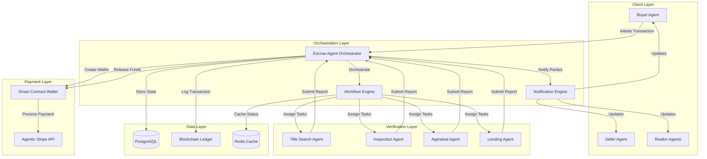

# Design Document: Intelligent Escrow Agents

## Overview

The Intelligent Escrow Agents system automates real estate transaction management through a multi-agent orchestration architecture. The system coordinates specialized verification agents (title, inspection, appraisal, lending) and manages milestone-based fund releases via Agentic Stripe smart contract wallets. The design leverages event-driven workflows, blockchain logging for audit trails, and real-time notifications to reduce closing cycles from 30-45 days to 7-14 days.

### Key Design Principles

- **Agent Autonomy**: Each agent operates independently with clear responsibilities and interfaces
- **Event-Driven Coordination**: Agents communicate through events rather than direct coupling
- **Immutable Audit Trail**: All transactions logged on-chain per AP2 mandates
- **Fail-Safe Fund Management**: Smart contracts ensure funds are only released when conditions are met
- **Parallel Workflow Execution**: Verification tasks run concurrently where dependencies allow

## Architecture

### High-Level Architecture



### Component Architecture

The system follows a microservices-inspired architecture with clear separation of concerns:

1. **API Layer** (`api/escrow/`): FastAPI endpoints for transaction management
2. **Agent Layer** (`agents/`): Autonomous agent implementations
3. **Service Layer** (`services/`): External integrations (Agentic Stripe, blockchain)
4. **Model Layer** (`models/`): Data models and database schemas
5. **Workflow Layer** (`workflows/`): State machine and orchestration logic

## Components and Interfaces

### 1. Escrow Agent Orchestrator

**Responsibility**: Central coordinator for transaction lifecycle management

**Key Methods**:
```python
class EscrowAgentOrchestrator:
    async def initiate_transaction(
        self,
        buyer_agent_id: str,
        seller_agent_id: str,
        property_id: str,
        earnest_money: Decimal,
        transaction_details: Dict[str, Any]
    ) -> Transaction
    
    async def process_verification_completion(
        self,
        transaction_id: str,
        verification_type: VerificationType,
        report: VerificationReport
    ) -> None
    
    async def execute_settlement(
        self,
        transaction_id: str
    ) -> SettlementResult
    
    async def handle_dispute(
        self,
        transaction_id: str,
        dispute_details: DisputeDetails
    ) -> DisputeResolution
```

**State Management**: Uses a state machine pattern with states:
- `INITIATED`: Transaction created, awaiting earnest money
- `FUNDED`: Earnest money received, verification tasks assigned
- `VERIFICATION_IN_PROGRESS`: Agents working on verification tasks
- `VERIFICATION_COMPLETE`: All verifications approved
- `SETTLEMENT_PENDING`: Final calculations complete, awaiting execution
- `SETTLED`: All funds distributed
- `DISPUTED`: Issue raised, resolution in progress
- `CANCELLED`: Transaction terminated

### 2. Workflow Engine

**Responsibility**: Manages parallel verification workflows and task dependencies

**Key Features**:
- DAG (Directed Acyclic Graph) based workflow definition
- Parallel task execution where dependencies allow
- Automatic retry logic with exponential backoff
- Deadline tracking and escalation

**Workflow Definition**:
```python
class VerificationWorkflow:
    def __init__(self, transaction: Transaction):
        self.tasks = {
            "title_search": Task(
                agent=TitleSearchAgent,
                dependencies=[],
                deadline_days=5,
                payment_amount=Decimal("1200.00")
            ),
            "inspection": Task(
                agent=InspectionAgent,
                dependencies=[],
                deadline_days=7,
                payment_amount=Decimal("500.00")
            ),
            "appraisal": Task(
                agent=AppraisalAgent,
                dependencies=["inspection"],  # Wait for inspection
                deadline_days=5,
                payment_amount=Decimal("400.00")
            ),
            "lending": Task(
                agent=LendingAgent,
                dependencies=["title_search", "appraisal"],
                deadline_days=10,
                payment_amount=Decimal("0.00")  # Lender paid separately
            )
        }
```

### 3. Verification Agents

**Base Interface**:
```python
class VerificationAgent(ABC):
    @abstractmethod
    async def execute_verification(
        self,
        transaction: Transaction,
        task_details: TaskDetails
    ) -> VerificationReport
    
    @abstractmethod
    async def validate_report(
        self,
        report: VerificationReport
    ) -> ValidationResult
```

**Implementations**:

- **TitleSearchAgent**: Coordinates with title companies, validates chain of title
- **InspectionAgent**: Schedules property inspection, validates inspection report
- **AppraisalAgent**: Coordinates appraisal, validates property value
- **LendingAgent**: Coordinates with lenders, validates loan approval

Each agent maintains its own state and communicates via events.

### 4. Smart Contract Wallet Manager

**Responsibility**: Interface with Agentic Stripe for fund management

**Key Methods**:
```python
class SmartContractWalletManager:
    async def create_wallet(
        self,
        transaction_id: str,
        initial_deposit: Decimal
    ) -> WalletDetails
    
    async def configure_milestones(
        self,
        wallet_id: str,
        milestones: List[Milestone]
    ) -> None
    
    async def release_milestone_payment(
        self,
        wallet_id: str,
        milestone_id: str,
        recipient: str,
        amount: Decimal
    ) -> PaymentResult
    
    async def execute_final_settlement(
        self,
        wallet_id: str,
        distributions: List[Distribution]
    ) -> SettlementResult
```

**Milestone Configuration**:
```python
@dataclass
class Milestone:
    id: str
    name: str
    amount: Decimal
    recipient: str
    conditions: List[Condition]
    auto_release: bool = True
```

### 5. Blockchain Logger

**Responsibility**: Log all transactions on-chain per AP2 mandates

**Key Methods**:
```python
class BlockchainLogger:
    async def log_transaction_event(
        self,
        transaction_id: str,
        event_type: EventType,
        event_data: Dict[str, Any],
        timestamp: datetime
    ) -> str  # Returns transaction hash
    
    async def get_audit_trail(
        self,
        transaction_id: str
    ) -> List[BlockchainEvent]
    
    async def verify_event(
        self,
        transaction_hash: str
    ) -> bool
```

**Event Types Logged**:
- Transaction initiation
- Earnest money deposit
- Verification task assignments
- Verification completions
- Payment releases
- Settlement execution
- Dispute events

### 6. Notification Engine

**Responsibility**: Multi-channel notifications to all parties

**Channels**:
- Email (via SendGrid/Gmail API)
- SMS (via Twilio)
- Webhooks (for agent-to-agent communication)
- In-app notifications

**Key Methods**:
```python
class NotificationEngine:
    async def notify_transaction_parties(
        self,
        transaction_id: str,
        event: NotificationEvent,
        channels: List[NotificationChannel]
    ) -> None
    
    async def send_escalation_alert(
        self,
        transaction_id: str,
        issue: EscalationIssue
    ) -> None
```

## Data Models

### Core Models

```python
class Transaction(BaseModel):
    """Main transaction entity"""
    id: str
    buyer_agent_id: str
    seller_agent_id: str
    property_id: str
    earnest_money: Decimal
    total_purchase_price: Decimal
    state: TransactionState
    wallet_id: Optional[str]
    initiated_at: datetime
    target_closing_date: datetime
    actual_closing_date: Optional[datetime]
    metadata: Dict[str, Any]
    created_at: datetime
    updated_at: datetime


class VerificationTask(BaseModel):
    """Verification task assigned to an agent"""
    id: str
    transaction_id: str
    verification_type: VerificationType
    assigned_agent_id: str
    status: TaskStatus
    deadline: datetime
    payment_amount: Decimal
    report_id: Optional[str]
    assigned_at: datetime
    completed_at: Optional[datetime]
    created_at: datetime
    updated_at: datetime


class VerificationReport(BaseModel):
    """Report submitted by verification agent"""
    id: str
    task_id: str
    agent_id: str
    report_type: VerificationType
    status: ReportStatus  # APPROVED, REJECTED, NEEDS_REVIEW
    findings: Dict[str, Any]
    documents: List[str]  # URLs to supporting documents
    submitted_at: datetime
    reviewed_at: Optional[datetime]
    reviewer_notes: Optional[str]
    created_at: datetime


class Payment(BaseModel):
    """Payment transaction record"""
    id: str
    transaction_id: str
    wallet_id: str
    payment_type: PaymentType  # VERIFICATION, COMMISSION, SETTLEMENT
    recipient_id: str
    amount: Decimal
    status: PaymentStatus
    blockchain_tx_hash: str
    initiated_at: datetime
    completed_at: Optional[datetime]
    created_at: datetime


class Settlement(BaseModel):
    """Final settlement record"""
    id: str
    transaction_id: str
    total_amount: Decimal
    seller_amount: Decimal
    buyer_agent_commission: Decimal
    seller_agent_commission: Decimal
    closing_costs: Decimal
    distributions: List[Distribution]
    blockchain_tx_hash: str
    executed_at: datetime
    created_at: datetime


class BlockchainEvent(BaseModel):
    """On-chain event log"""
    id: str
    transaction_id: str
    event_type: EventType
    event_data: Dict[str, Any]
    blockchain_tx_hash: str
    block_number: int
    timestamp: datetime
    created_at: datetime
```

### Enums

```python
class TransactionState(str, Enum):
    INITIATED = "initiated"
    FUNDED = "funded"
    VERIFICATION_IN_PROGRESS = "verification_in_progress"
    VERIFICATION_COMPLETE = "verification_complete"
    SETTLEMENT_PENDING = "settlement_pending"
    SETTLED = "settled"
    DISPUTED = "disputed"
    CANCELLED = "cancelled"


class VerificationType(str, Enum):
    TITLE_SEARCH = "title_search"
    INSPECTION = "inspection"
    APPRAISAL = "appraisal"
    LENDING = "lending"


class TaskStatus(str, Enum):
    ASSIGNED = "assigned"
    IN_PROGRESS = "in_progress"
    COMPLETED = "completed"
    FAILED = "failed"
    CANCELLED = "cancelled"


class PaymentType(str, Enum):
    EARNEST_MONEY = "earnest_money"
    VERIFICATION = "verification"
    COMMISSION = "commission"
    CLOSING_COST = "closing_cost"
    SETTLEMENT = "settlement"
```

## Error Handling

### Error Categories

1. **Validation Errors**: Invalid input data, business rule violations
2. **Integration Errors**: External service failures (Agentic Stripe, blockchain)
3. **Workflow Errors**: Task failures, deadline violations
4. **Payment Errors**: Insufficient funds, payment processing failures
5. **Dispute Errors**: Contested verifications, settlement disputes

### Error Handling Strategy

```python
class EscrowError(Exception):
    """Base exception for escrow system"""
    pass


class ValidationError(EscrowError):
    """Validation failure"""
    pass


class PaymentError(EscrowError):
    """Payment processing failure"""
    pass


class WorkflowError(EscrowError):
    """Workflow execution failure"""
    pass


class IntegrationError(EscrowError):
    """External service failure"""
    pass
```

### Retry Logic

- **Payment Operations**: 3 retries with exponential backoff (1s, 2s, 4s)
- **Blockchain Logging**: 5 retries with exponential backoff (2s, 4s, 8s, 16s, 32s)
- **Verification Tasks**: No automatic retry, escalate to human review
- **Notifications**: 3 retries with 5-second intervals

### Circuit Breaker Pattern

Implement circuit breakers for external services:
- **Agentic Stripe**: Open after 5 consecutive failures, half-open after 60s
- **Blockchain RPC**: Open after 10 consecutive failures, half-open after 30s
- **Notification Services**: Open after 3 consecutive failures, half-open after 120s

## Testing Strategy

### Unit Tests

- **Agent Logic**: Test each agent's verification and validation logic
- **Workflow Engine**: Test task scheduling, dependency resolution, parallel execution
- **Payment Manager**: Test milestone configuration, payment release logic
- **State Machine**: Test all state transitions and edge cases

### Integration Tests

- **Agentic Stripe Integration**: Test wallet creation, milestone configuration, payment execution
- **Blockchain Integration**: Test event logging, audit trail retrieval
- **Database Operations**: Test transaction CRUD, concurrent updates
- **Notification Delivery**: Test multi-channel notification delivery

### End-to-End Tests

- **Happy Path**: Complete transaction from initiation to settlement
- **Verification Failure**: Handle rejected verification reports
- **Payment Failure**: Handle insufficient funds, payment processing errors
- **Deadline Violations**: Handle missed deadlines and escalations
- **Dispute Resolution**: Handle disputed transactions

### Performance Tests

- **Concurrent Transactions**: Test system under load with 100+ concurrent transactions
- **Workflow Execution Time**: Verify parallel execution reduces total time
- **Payment Processing Time**: Measure end-to-end payment latency
- **Blockchain Logging Throughput**: Test event logging rate

### Test Data

- Use factory pattern for generating test transactions
- Mock external services (Agentic Stripe, blockchain RPC)
- Use in-memory database for fast test execution
- Implement test fixtures for common scenarios

## Security Considerations

### Authentication & Authorization

- **Agent Authentication**: JWT-based authentication for all agents
- **Role-Based Access Control**: Agents can only access their assigned tasks
- **Wallet Access Control**: Only Escrow Agent can trigger payments
- **Audit Log Access**: Read-only access to blockchain events

### Data Protection

- **Encryption at Rest**: Encrypt sensitive transaction data in database
- **Encryption in Transit**: TLS 1.3 for all API communications
- **PII Protection**: Encrypt personally identifiable information
- **Key Management**: Use AWS KMS or similar for key storage

### Smart Contract Security

- **Multi-Signature Requirements**: Require multiple approvals for large settlements
- **Time Locks**: Implement time delays for large fund releases
- **Emergency Pause**: Circuit breaker to halt all payments in case of security incident
- **Audit Trail**: Immutable log of all wallet operations

### Compliance

- **AP2 Mandates**: Full compliance with Audit Protocol 2 requirements
- **KYC/AML**: Verify all agent identities before allowing transactions
- **Data Retention**: Maintain transaction records per regulatory requirements
- **Privacy Regulations**: GDPR/CCPA compliance for personal data

## Deployment Architecture

### Infrastructure

- **API Servers**: Kubernetes cluster with auto-scaling (min 3, max 20 pods)
- **Database**: PostgreSQL with read replicas for high availability
- **Cache**: Redis cluster for workflow state caching
- **Message Queue**: RabbitMQ for async event processing
- **Blockchain Node**: Dedicated node for transaction logging

### Monitoring & Observability

- **Metrics**: Prometheus for system metrics, Grafana for visualization
- **Logging**: Structured logging with ELK stack
- **Tracing**: Distributed tracing with Jaeger
- **Alerting**: PagerDuty integration for critical failures

### Key Metrics

- Transaction throughput (transactions/hour)
- Average closing cycle time (days)
- Verification task completion rate (%)
- Payment success rate (%)
- System uptime (%)
- API response time (p50, p95, p99)

## Integration Points

### Agentic Stripe Integration

**Purpose**: Smart contract wallet management and payment processing

**Key Operations**:
- Create wallet with milestone configuration
- Release milestone payments
- Execute final settlement
- Query wallet balance and transaction history

**Configuration**:
```python
AGENTIC_STRIPE_API_KEY: str
AGENTIC_STRIPE_WEBHOOK_SECRET: str
AGENTIC_STRIPE_NETWORK: str  # mainnet or testnet
```

### Blockchain Integration

**Purpose**: Immutable audit trail per AP2 mandates

**Key Operations**:
- Log transaction events
- Retrieve audit trail
- Verify event authenticity

**Configuration**:
```python
BLOCKCHAIN_RPC_URL: str
BLOCKCHAIN_NETWORK: str
BLOCKCHAIN_CONTRACT_ADDRESS: str
BLOCKCHAIN_PRIVATE_KEY: str  # For signing transactions
```

### Notification Services

**Purpose**: Multi-channel notifications to transaction parties

**Integrations**:
- SendGrid/Gmail API for email
- Twilio for SMS
- Webhooks for agent-to-agent communication

**Configuration**:
```python
SENDGRID_API_KEY: str
TWILIO_ACCOUNT_SID: str
TWILIO_AUTH_TOKEN: str
TWILIO_PHONE_NUMBER: str
```

## Performance Optimization

### Caching Strategy

- **Transaction State**: Cache in Redis with 5-minute TTL
- **Verification Reports**: Cache completed reports for 24 hours
- **Agent Profiles**: Cache agent details for 1 hour
- **Blockchain Events**: Cache recent events for 15 minutes

### Database Optimization

- **Indexes**: Create indexes on transaction_id, state, created_at
- **Partitioning**: Partition transactions table by created_at (monthly)
- **Connection Pooling**: Use connection pool (size: 20, max overflow: 10)
- **Read Replicas**: Route read queries to replicas

### Async Processing

- **Event Processing**: Use async workers for blockchain logging
- **Notifications**: Queue notifications for batch processing
- **Report Validation**: Async validation with callback pattern
- **Settlement Calculation**: Background job for complex calculations

## Future Enhancements

1. **Machine Learning**: Predict transaction completion time based on historical data
2. **Dynamic Pricing**: Adjust verification agent fees based on market conditions
3. **Multi-Currency Support**: Support transactions in multiple currencies
4. **Cross-Border Transactions**: Handle international real estate transactions
5. **Mobile App**: Native mobile apps for agents
6. **Advanced Analytics**: Dashboard for transaction insights and trends
